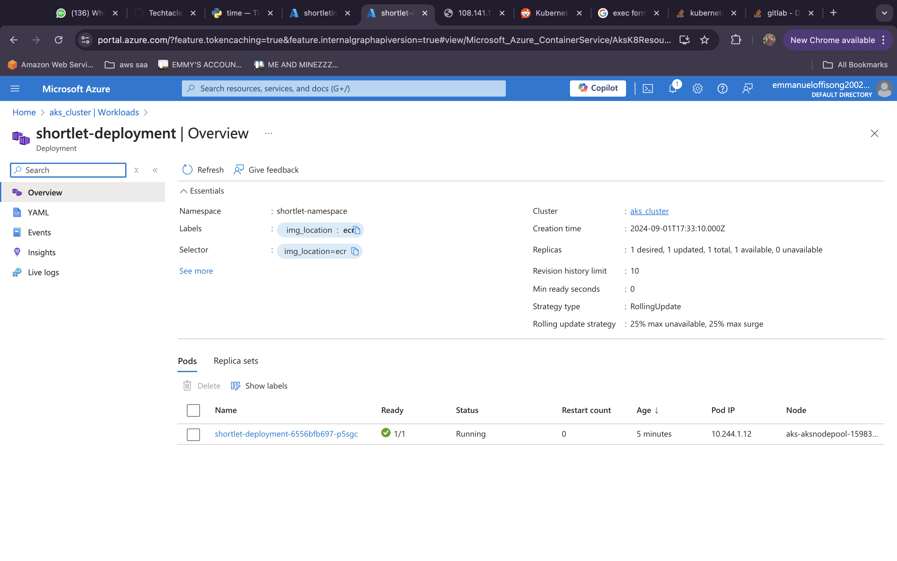
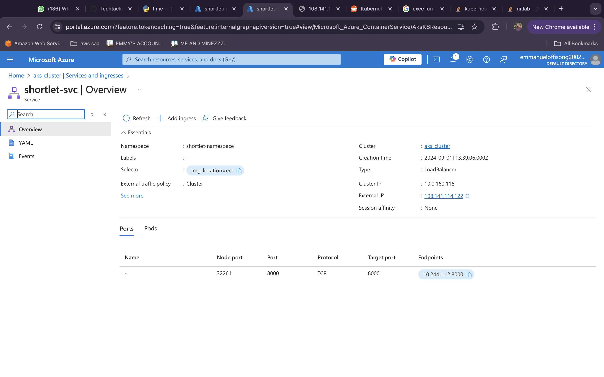

# shortlet_infra_azure
In this project, we have three layers  
- application layer 
- azure infra layer  
- kubernetes infra layer 
 
The application layer is the api layer which uses fast api to return the current time. In this layer, there is a Dockerfile which we Kubernetes uses to create deployments and services. 

# INFRA LAYER
The infra layer uses terraform to build the necessary azurem components like  
- azure container registry 
- azure kubernetes service 
- vpcs, including subnets, nat gateways, route tables, etc 
- resource group. 

# KUBERNETES LAYER
This layer handles the deployment of kubernetes services using Terraform. It handles the deployment of  
- Pods  
- Deployments  
- Service accounts  
- Load balancer service  
- Metrics server  
This uses the images in ecr to create a deployment.

# GITHUB ACTIONS
THe workflow for GitHub actions is :
--> Terraform build azuremresources --> Build and push application layer to acr --> Build the kubernetes internal layer --> Update the terraform docs dynamically
